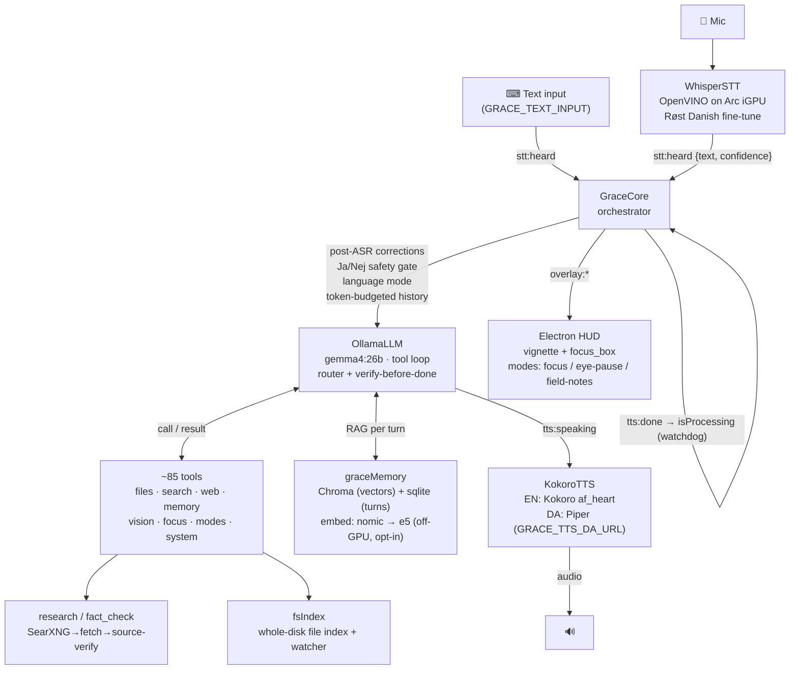

# Grace — Architecture Diagram

The runtime data flow. Everything talks over the typed `bus` (`@grace/core`). See
`2-ARCHITECTURE-AND-SYSTEM.md` for the prose version.

**Side processes (HTTP, launched by `start-grace.ps1`):** `grace_whisper_server.py` (STT),
`grace_kokoro_server.py` (EN TTS), `grace_da_tts_server.py` (DA TTS), optional
`grace_embed_server.py` (e5 embedder), Ollama, and Docker: SearXNG (search) + ChromaDB (memory).
